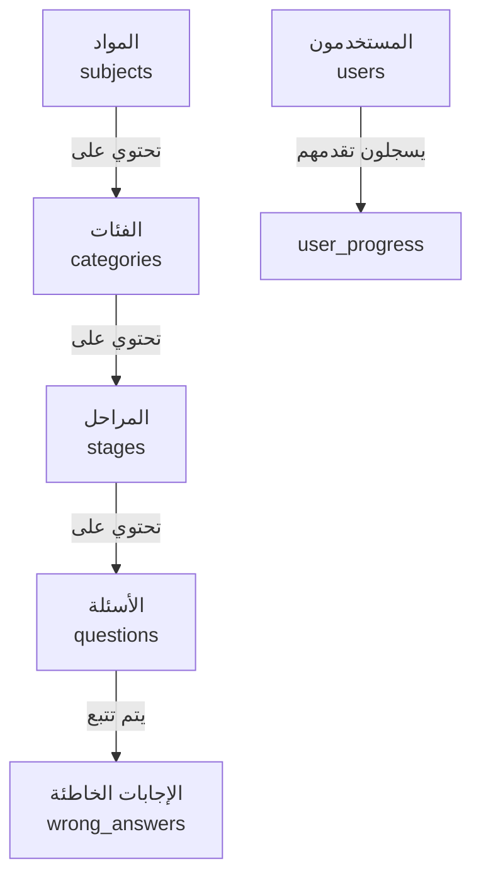

# دليل إدارة المحتوى - KHTMTHA Game

## 📋 نظرة عامة

هذا الدليل يشرح كيفية إضافة أسئلة جديدة وإدارة المراحل والمواد في لعبة KHTMTHA.

---

## 🗺️ هيكل قاعدة البيانات



### العلاقات بين الجداول:

| الجدول | الارتباط | الوصف |
|--------|---------|-------|
| **subjects** | جذر | المواد الدراسية (أحياء، إنجليزي) |
| **categories** | subject_id → subjects.id | أنواع المراجعة (فصول، نصف سنة، سنة كاملة) |
| **stages** | category_id → categories.id | المراحل/الأجزاء داخل كل فئة |
| **questions** | stage_id → stages.id | الأسئلة في كل مرحلة |

---

## 📚 إضافة مادة جديدة

### الخطوة 1: إضافة المادة في جدول subjects

```sql
INSERT INTO subjects (name, name_ar, order_index)
VALUES ('Chemistry', 'الكيمياء', 3);
```

| العمود | الوصف | مثال |
|--------|-------|------|
| name | اسم المادة بالإنجليزية | 'Chemistry' |
| name_ar | اسم المادة بالعربية | 'الكيمياء' |
| order_index | ترتيب الظهور | 3 |

---

## 📂 إضافة فئة جديدة

### الخطوة 2: إضافة الفئة في جدول categories

```sql
INSERT INTO categories (subject_id, name, name_ar, order_index)
VALUES (
    (SELECT id FROM subjects WHERE name = 'Chemistry'),
    'Chapters_Review',
    'مراجعة الفصول',
    1
);
```

| العمود | الوصف | القيم المسموحة |
|--------|-------|----------------|
| name | نوع المراجعة | Chapters_Review, FullYear, HalfYear |
| name_ar | الاسم بالعربية | أي نص |

---

## 🎯 إضافة مرحلة جديدة

### الخطوة 3: إضافة المرحلة في جدول stages

```sql
INSERT INTO stages (category_id, name, name_ar, chapter_no, part_no, order_index)
VALUES (
    (SELECT id FROM categories WHERE name = 'Chapters_Review' AND subject_id = 3),
    'Chemistry_Ch1_Part1',
    'الجزء 1 - الفصل 1',
    1,
    1,
    11
);
```

| العمود | الوصف | مثال |
|--------|-------|------|
| name | اسم الملف الأصلي | 'Chemistry_Ch1_Part1' |
| name_ar | الاسم المعروض | 'الجزء 1 - الفصل 1' |
| chapter_no | رقم الفصل | 1, 2, 3... |
| part_no | رقم الجزء | 1, 2, 3... |
| order_index | ترتيب الفرز | 11, 12, 13... |

---

## ❓ إضافة أسئلة

### الخطوة 4: إضافة الأسئلة في جدول questions

```sql
INSERT INTO questions (
    stage_id, 
    question_no, 
    question_text, 
    question_type,
    option_a, 
    option_b, 
    option_c, 
    option_d, 
    correct_answer
) VALUES 
(
    91,  -- معرف المرحلة
    1,   -- رقم السؤال
    'العنصر الكيميائي يتكون من؟',
    'اختيار من متعدد',
    'ذرات',
    'جزيئات',
    'إلكترونات',
    'نواة',
    'ذرات'
);
```

### هيكل جدول questions:

| العمود | النوع | مطلوب | وصف |
|--------|-------|-------|-----|
| id | uuid | تلقائي | معرف فريد |
| stage_id | uuid | نعم | يرتبط بجدول stages |
| question_no | int | نعم | رقم السؤال في المرحلة |
| question_text | text | نعم | نص السؤال |
| question_type | text | لا | نوع السؤال |
| option_a | text | نعم | الخيار أ |
| option_b | text | نعم | الخيار ب |
| option_c | text | لا | الخيار ج |
| option_d | text | لا | الخيار د |
| correct_answer | text | نعم | الإجابة الصحيحة |

---

## 📊 عدد الخيارات

### كيف يحدد اللعبة عدد الخيارات؟

اللعبة **تلقائية** في قراءة عدد الخيارات:

| إذا كان في قاعدة البيانات | اللعبة تعرض |
|---------------------------|-------------|
| option_a + option_b فقط | خياران (أ، ب) |
| option_a + option_b + option_c | ثلاثة خيارات (أ، ب، ج) |
| option_a + option_b + option_c + option_d | أربعة خيارات (أ، ب، ج، د) |

### مثال على ثلاثة خيارات:
```sql
-- سؤال إنجليزي (3 خيارات)
option_a: 'are'
option_b: 'is'
option_c: 'am'
option_d: NULL  -- أو فارغ
```

### مثال على أربعة خيارات:
```sql
-- سؤال أحياء (4 خيارات)
option_a: 'الدكتيوسوم'
option_b: 'الميتوكوندريا'
option_c: 'الليسوسوم'
option_d: 'البيروكسيسوم'
```

---

## 📁 استيراد من Excel

### هيكل ملف Excel المطلوب:

| العمود | A | B | C | D | E | F | G |
|--------|---|---|---|---|---|---|---|
| **الصف 1** | رقم السؤال | نص السؤال | النوع | خيار أ | خيار ب | خيار ج | خيار د |
| **الصف 2** | 1 | السؤال الأول... | اختيار | إجابة أ | إجابة ب | إجابة ج | إجابة د |
| **الصف 3** | 2 | السؤال الثاني... | اختيار | إجابة أ | إجابة ب | إجابة ج | إجابة د |

### تسمية الملفات:

```
All files excel/
├── Chemistry/
│   ├── Chapters_Review/
│   │   ├── Chemistry_Ch1_Part1_Review.xlsx
│   │   ├── Chemistry_Ch1_Part2_Review.xlsx
│   │   └── Chemistry_Ch1_Part3_Review.xlsx
│   ├── FullYear/
│   │   └── Chemistry_FullYear_Part01.xlsx
│   └── HalfYear/
│       └── Chemistry_HalfYear_Part01.xlsx
```

### تشغيل الاستيراد:

```bash
cd scripts
node import-excel.js
```

---

## 🔒 نظام قفل المراحل

### كيف يعمل؟


### أنواع القفل:

| نوع الفئة | منطق القفل |
|-----------|-----------|
| **Chapters_Review** | كل جزء من نفس الفصل يفتح بعد إكمال الجزء السابق |
| **FullYear** | مرحلة تراكمي - كل مرحلة تفتح بعد إكمال السابقة |
| **HalfYear** | مرحلة تراكمي - كل مرحلة تفتح بعد إكمال السابقة |

### جدول user_progress:

```sql
-- عند إكمال مرحلة، يتم إنشاء سجل هنا
INSERT INTO user_progress (
    user_id,
    stage_id,
    completed,
    stars,
    best_score,
    completed_at
) VALUES (
    'uuid-المستخدم',
    91,
    true,
    3,  -- عدد النجوم (1-3)
    1500,
    NOW()
);
```

---

## ⭐ نظام النجوم

### حساب النجوم بناءً على الدقة:

| الدقة | النجوم |
|-------|--------|
| 90% أو أكثر | ⭐⭐⭐ 3 نجوم |
| 70% - 89% | ⭐⭐ 2 نجوم |
| 50% - 69% | ⭐ 1 نجمة |
| أقل من 50% | 0 نجوم |

### حساب الدقة:
```
الدقة = (عدد الإجابات الصحيحة / إجمالي الأسئلة) × 100
```

---

## 🛠️ نصائح مهمة

### 1. الإجابة الصحيحة
- يجب أن تتطابق `correct_answer` مع أحد الخيارات (A, B, C, أو D)
- مثال: إذا كان الخيار أ = "القاهرة"، فيجب أن تكون correct_answer = "القاهرة"

### 2. ترتيب الفرز (order_index)
- Chapters_Review: استخدم `(chapter_no × 10) + part_no`
  - الفصل 1 الجزء 1 = 11
  - الفصل 1 الجزء 2 = 12
  - الفصل 2 الجزء 1 = 21

- FullYear/HalfYear: استخدم رقم الجزء فقط
  - الجزء 1 = 1
  - الجزء 2 = 2

### 3. الأمان (RLS)
- جميع الجداول مفعل فيها Row Level Security
- المستخدمون يمكنهم قراءة الأسئلة فقط
- التعديل يكون من خلال Supabase Dashboard فقط

---

## 📈 الإحصائيات الحالية

| المادة | المراحل | الأسئلة |
|--------|---------|---------|
| الأحياء | 30 | 645 |
| الإنجليزي | 60 | 1,438 |
| **الإجمالي** | **90** | **2,083** |

---

## 🆘 الدعم الفني

لأي استفسارات أو مشاكل في إضافة المحتوى:

1. افتح Supabase Dashboard
2. انتظر إلى Table Editor
3. تابع الجدول المطلوب تعديله
4. أضف أو عدل البيانات مباشرة

**ملاحظة**: التغييرات تظهر في اللعبة فوراً بعد التحديث (F5).
